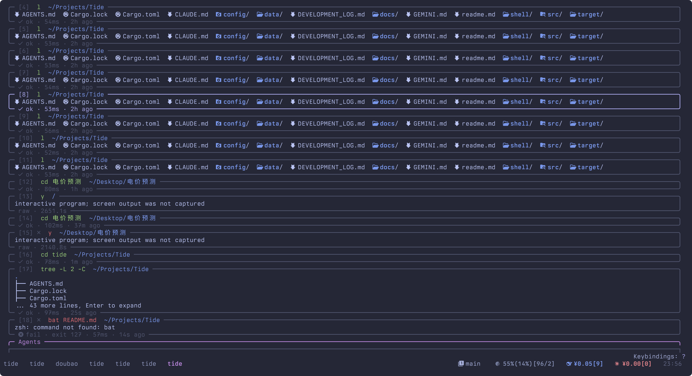

# Tide 🌊

[](https://github.com/refiget/tide)
> **Status**: Early Alpha. A layered shell wrapper that turns zsh history into navigable blocks.

Tide wraps a real `zsh` session in a PTY, captures lifecycle markers (via OSC 777), and reconstructs shell history into structured views. It's not a terminal emulator or a shell replacement; it's an interactive layer on top of your existing shell.

## Core Concepts

### Warp-inspired Block Design
Tide breaks away from the traditional linear stream by grouping command output into discrete **Blocks**.
- **Structured History**: Each execution has its own boundary, status, and metadata (duration, exit code, CWD).
- **Layered Views**:
    - **Normal**: Transparent passthrough to your zsh session.
    - **Block**: Navigable history overlay with Catppuccin-styled borders and TUI interactions.
    - **Detail**: Full-screen pager for deep inspection of individual blocks.


### OpenCode Integration & Unified Jump
Tide shares a registry for running agent sessions across different terminal panes.
- **Cross-pane Visibility**: Detect and monitor active agents in your tmux environment.
- **Unified Jump**: Press `i` on an agent block to immediately switch and zoom to its target tmux pane.

## Project Status

Tide is in its early stages. Current focus is on the core Block Layer loop:
- [x] **Zero-overhead Passthrough**: All TUI apps (vim, fzf, etc.) work natively in Normal mode.
- [x] **Marker-based Capture**: Precise command boundaries using `preexec`/`precmd` hooks.
- [x] **Ratatui Rendering**: High-performance TUI engine with 16ms frame limit.
- [x] **Search & Filter**: Substring token match for command history and failed-only filters.



## Quick Start

### Requirements
- Rust toolchain
- zsh (requires [shell/zsh-integration.zsh](./shell/zsh-integration.zsh) in your `.zshrc`)

### Run
```bash
cargo run
```

## Keybindings

| Mode | Key | Action |
| :--- | :--- | :--- |
| **Normal** | `Ctrl-B` | Enter Block View |
| **Block** | `j` / `k` | Navigate blocks |
| **Block** | `Enter` | Toggle inline expansion |
| **Block** | `i` | Detail View / **Unified Jump** |
| **Block** | `f` | Toggle failed-only filter |
| **Block** | `/` | Command search |
| **Detail** | `q` / `Esc` | Back to Block View |

## Documentation
- [Architecture](./docs/architecture.md)
- [Block Layer](./docs/block-layer.md)
- [Configuration](./docs/config.md)
- [Zsh Integration](./docs/zsh-integration.md)
